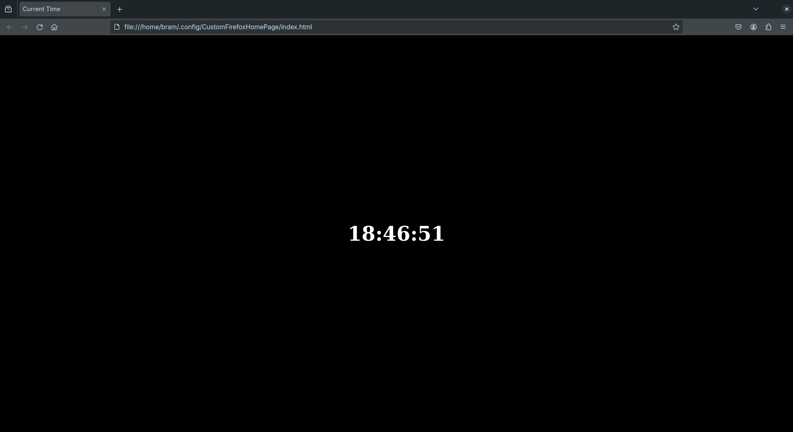

# Custom Firefox HomePage
This adds a custom home-page to Firefox. 
It serves a local html-file, so no need to set up a localhost server. 

This repository contains my own set-up, 
but in this README you can also see how you can set this up for yourself.

\ \

## How to do this yourself 
> [!Info]
> This will be for UNIX, Linux specific. 
> This might be possible on other platforms, but I don't know how

I followed this question: https://support.mozilla.org/en-US/questions/1251199

But here is condensed overview:
Inside the /usr/lib/firefox/ folder, create a new file called `autoconfig.cfg` with the content:
```js
var {classes: Cc, interfaces: Ci, utils: Cu} = Components;
var newTabURL = "file://<HTML_FILE_PATH>";
aboutNewTabService = Cc["@mozilla.org/browser/aboutnewtab-service;1"].getService(Ci.nsIAboutNewTabService);
aboutNewTabService.newTabURL = newTabURL;
```
Where you substitute `<HTML_FILE_PATH>` by the actual file-path to the html-file.

You also need the file in `defaults/pref/autoconfig.js`, with the content:
```js
pref("general.config.filename", "autoconfig.cfg");
pref("general.config.obscure_value", 0);
pref("general.config.sandbox_enabled", false);
```

Now there is one last thing, open Firefox and go to the settings.
Search for `Homepage and new windows`, and set it to `Custom URLs...`, 
and set the value to `file://<HTML_FILE_PATH>`, again replacing that with the real path.

\ \

## Preview my own home-page

