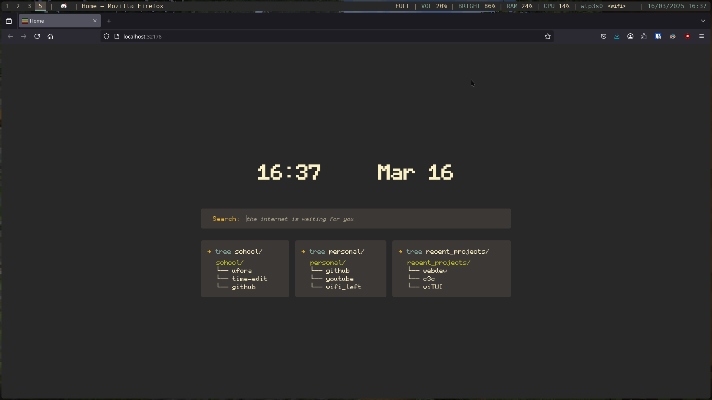

# Custom Firefox HomePage
I like tweaking and customising my own system, and adding a custom homepage
for Firefox is just right up that ally. At first I created a boring clock,
but with some inspiration from https://github.com/noriaku/FirefoxMonolite
(altough 'inspiration' doesn't really do it justice, I'll shamelessly admit
that I just copied the files I needed and edited them to my liking), I managed
to create something that really fits my current Gruvboxy vibe. (Did you notice
how horrible that previous sentence was constructed?)


## Preview my own home-page



## How to do this yourself
> [!NOTE]
> This will be for UNIX, Linux specific.
> This might be possible on other platforms, but I don't know how

- Clone this repository to your maching:
    ```sh
    git clone git@github.com:BWindey/CustomFirefoxHomePage.git
    cd CustomFirefoxHomePage
    ```
- rename and edit `EXAMPLE_profile.json` to `profile.json`:
    ```sh
    mv EXAMPLE_profile.json profile.json
    vim profile.json # Or with nano, emacs, ...
    ```
- serve the directory with your favourite http server, f.e. Python:
    ```sh
    python3 -m http.server 32178
    ```

Now you can open your browser on `localhost:32178` and check out your new
homepage.

To set it up as actual homepage in Firefox:
- open Firefox (`D=`)
- navigate to settings (or type in `about:preferences`)
- go to `Home` (or directly type in `about:preferences#home`)
- set `New Windows and Tabs` to `Custom URLs...` with `localhost:32178`


Great! It works! (I hope at least it does).
But one slight problem: I don't want start the server manually each and every
time I start my computer. That's where programs like `runit` or `systemd` come
in.

> [!warning]
> As always, don't just blindly type in the following commands.
> Make sure you know what they will do, because messing around with `sudo` around
> your root directory can have negative consequences!

Personally I use `runit`, that's the reason for the `run` script in this
repo. You can start it by symlinking: `sudo ln -s $(pwd) /etc/sv/` and
then `sudo ln -s /etc/sv/CustomFirefoxHomePage/ /var/service/`.

